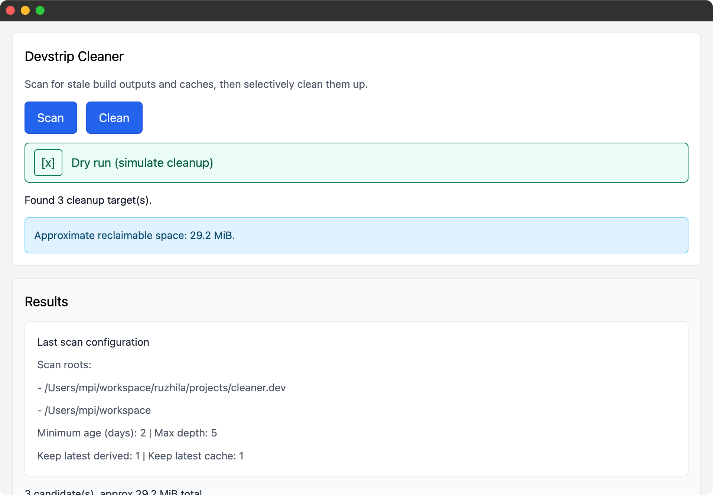
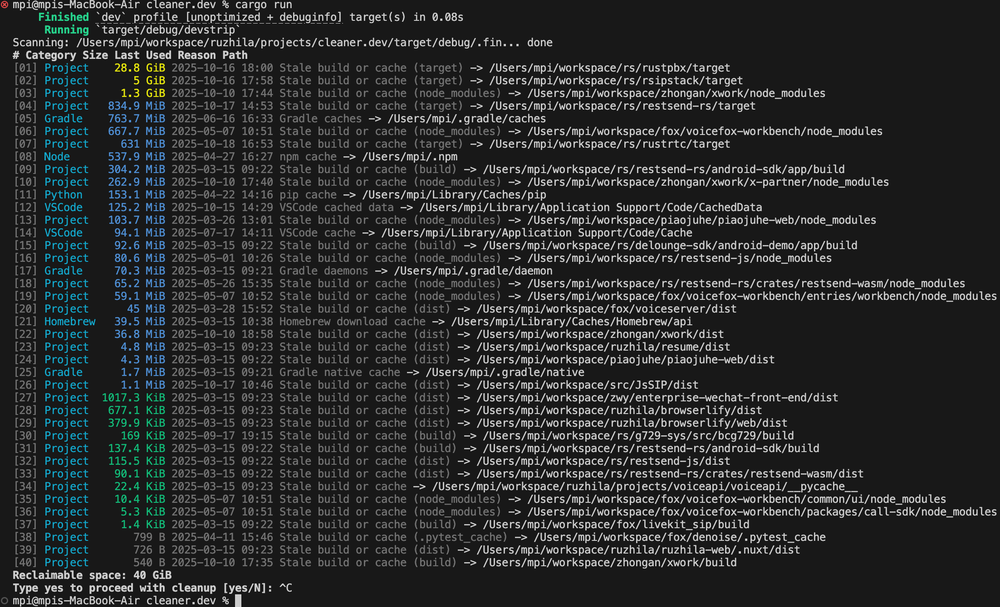

# DevStrip

DevStrip helps macOS developers reclaim disk space by pruning stale build products and language-specific caches. The project now ships with a native GUI powered by `gpui`, while the original command-line interface remains available as an opt-in feature.

## Requirements

- Rust toolchain 1.90 or newer (for `gpui.rs` support)
- macOS or a Unix-like environment with the same directory layout (the defaults target macOS developer caches)

## Installation

Install the latest published release from crates.io:

```bash
cargo install devstrip
```

## Quick Start (GUI)

The GUI is enabled by default. Launch it directly with:

```bash
cargo run
```

 

Alternatively, build it locally and run the binary from `target/release`:

```bash
cargo build --release
./target/release/devstrip --help
```


## CLI Usage

The command-line interface is still available, but you must disable the GUI feature and opt into the `cli` feature when running or building:

```bash
# Run the CLI directly
cargo run --no-default-features --features cli -- --help

# Install only the CLI binary
cargo install --no-default-features --features cli devstrip
```

All CLI flags remain the same as before. The examples below assume you are running in CLI mode.

 

## Usage

Run the tool from the directory you want to inspect, or provide additional roots explicitly. By default it scans the current working directory along with common project folders in your home directory (`Projects`, `workspace`, `Work`, `Developer`).

```bash
devstrip
```

Key options:

- `--roots <PATH>...` / positional `PATH`: additional directories to scan.
- `--exclude <PATH>`: skip a directory and everything under it.
- `--min-age-days <u64>`: only target directories older than the given age (default: 2 days).
- `--max-depth <u32>`: maximum depth to descend when scanning for project build folders (default: 5).
- `--keep-latest-derived <usize>`: keep the newest DerivedData and archive entries (default: 1).
- `--keep-latest-cache <usize>`: keep the newest Homebrew cache entries (default: 1).
- `--dry-run`: show what would be removed without deleting anything.
- `--yes`: skip the interactive confirmation prompt.
- `--no-color`: disable ANSI styling (also disabled automatically when `NO_COLOR` is set).
- `--all`: scan all default directories and your custom roots (may take a long time).

Example: perform a non-interactive cleanup of personal and work projects, while keeping two recent DerivedData folders and excluding a specific repository.

```bash
devstrip \
  --roots ~/Projects/personal ~/Work/company \
  --exclude ~/Projects/personal/ios-app \
  --keep-latest-derived 2 \
  --yes
```

During a dry run, the tool reports all candidates and the total reclaimable space but does not delete anything:

```bash
devstrip --dry-run
```

## How It Works

DevCleaner identifies large cache and build directories across several categories:

- Xcode DerivedData, Archives, and CoreSimulator caches
- Homebrew download caches
- Language-specific caches (Python, Node.js, Gradle, JetBrains IDEs, VS Code, Slack, and more)
- Project-local build artifacts like `target`, `node_modules`, `dist`, `coverage`, etc.

It estimates sizes, sorts candidates by size, and prints a summary before asking for confirmation (unless `--yes` is supplied). Progress is displayed while deletions are performed, and failures are reported with the underlying OS error.

## Safety Tips

- Always start with `--dry-run` to review what will be deleted.
- Use `--exclude` for repositories or cache folders that you never want removed.
- Combine `--keep-latest-derived` and `--keep-latest-cache` to retain recent builds that you may still need.

## Uninstall

If you previously installed DevStrip with `cargo install`, remove it with:

```bash
cargo uninstall devstrip
```
